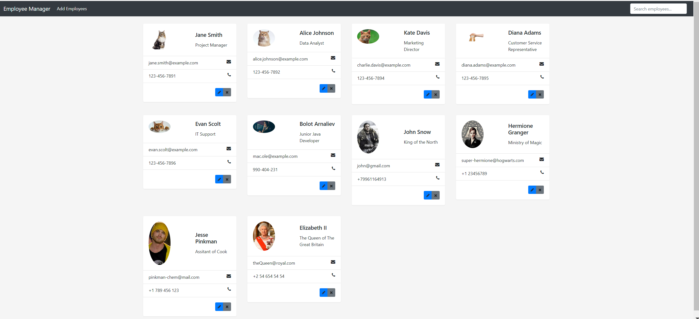
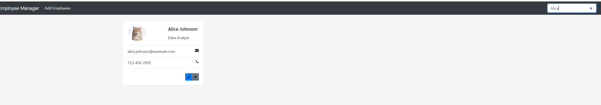
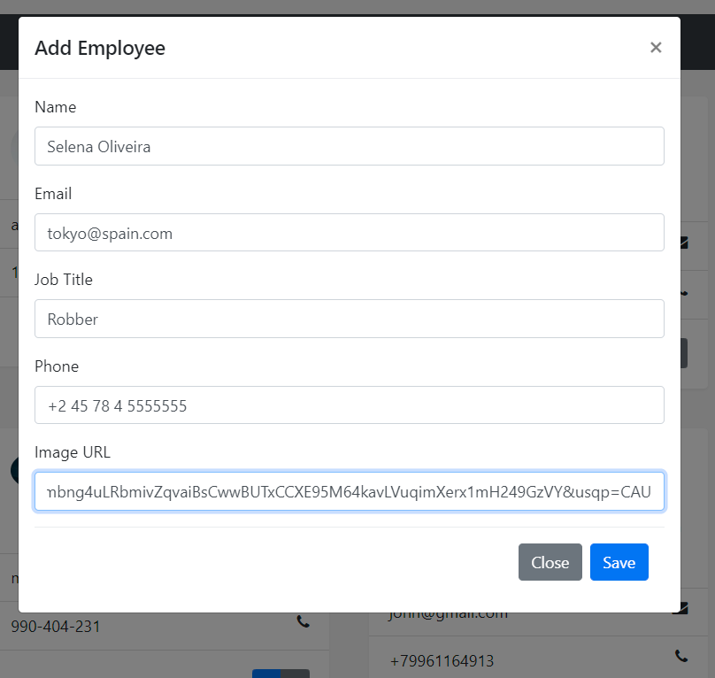
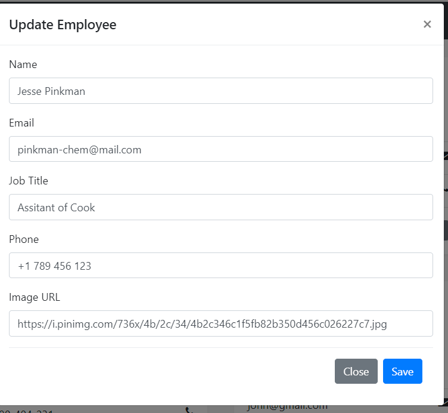
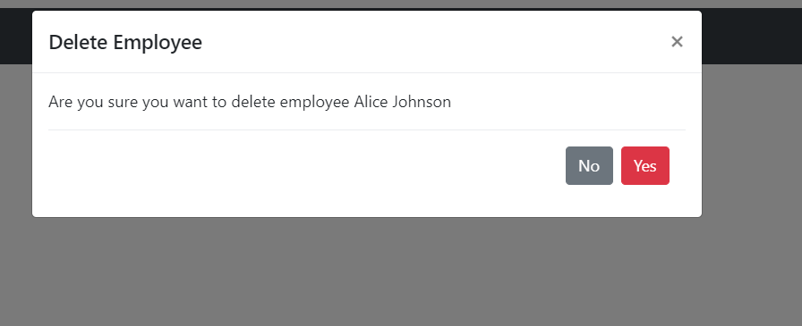

# EmployeeManagerApp

EmployeeManagerApp - это веб-приложение для управления списком сотрудников, разработанное с использованием Java, Spring, Postgres, Angular и Maven. В этом приложении можно добавлять, удалять, обновлять и искать информацию о сотрудниках. Для каждой операции (добавление, удаление, обновление) отображается модальное окно с подтверждением действия.

## Технологии

- **Java**
- **Spring Boot**
- **PostgreSQL**
- **Angular**
- **Maven**

## Описание функциональности

### Главный экран

Главный экран отображает список всех сотрудников. Пользователь может добавлять нового сотрудника, редактировать информацию о существующем сотруднике, удалять сотрудника или искать сотрудника по имени.



### Добавление сотрудника

При добавлении нового сотрудника открывается модальное окно, где пользователь вводит информацию о сотруднике. После подтверждения информация сохраняется в базе данных, и новый сотрудник отображается в списке.



### Обновление информации о сотруднике

При обновлении информации о сотруднике открывается модальное окно с текущими данными сотрудника. Пользователь может изменить необходимые поля и сохранить изменения. Обновлённая информация отображается в списке сотрудников.



### Удаление сотрудника

При удалении сотрудника открывается модальное окно с запросом подтверждения. После подтверждения сотрудник удаляется из базы данных и его информация удаляется из списка.



### Поиск сотрудника

Пользователь может искать сотрудников по имени, вводя запрос в поле поиска на главном экране. Результаты поиска отображаются в списке сотрудников.



## Установка и запуск

### Backend (Java + Spring Boot)

1. Убедитесь, что у вас установлен JDK (Java Development Kit).
2. Установите Apache Maven.
3. Настройте PostgreSQL базу данных и измените конфигурацию в `application.properties` в соответствии с вашими настройками базы данных.
4. Запустите следующие команды в корневом каталоге проекта для сборки и запуска приложения:

```bash
mvn clean install
mvn spring-boot:run
